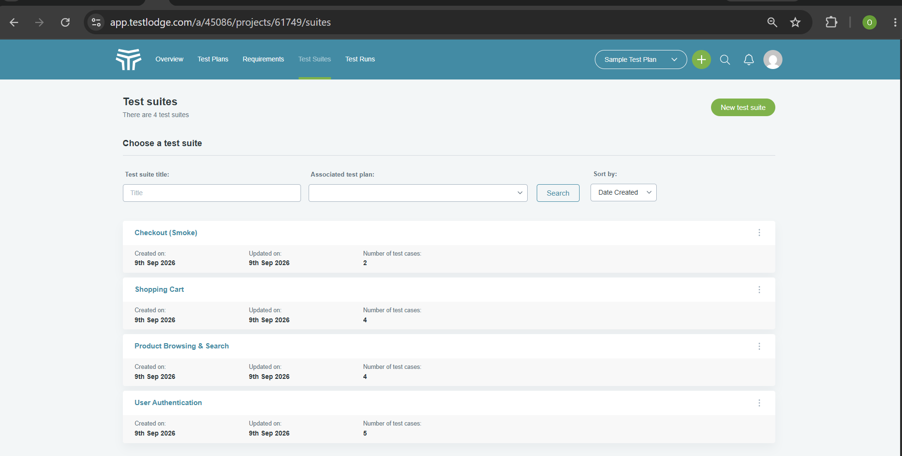
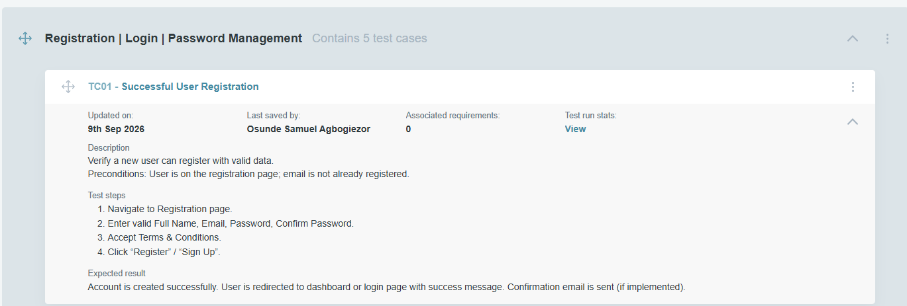
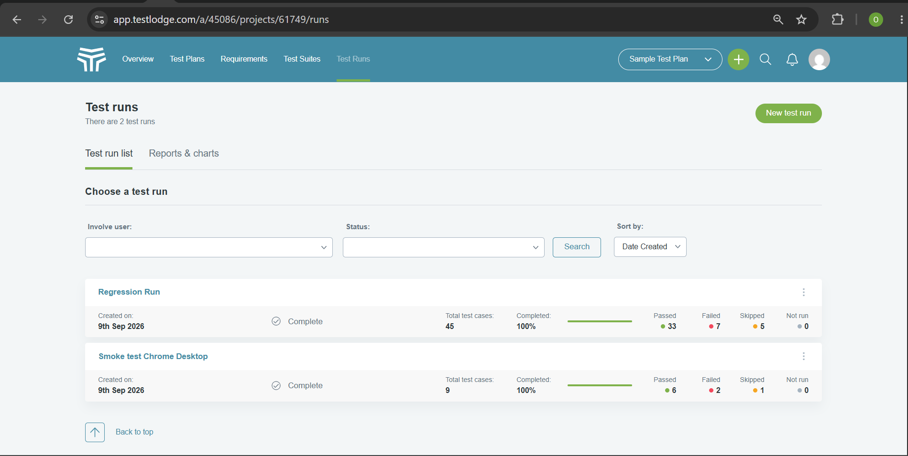
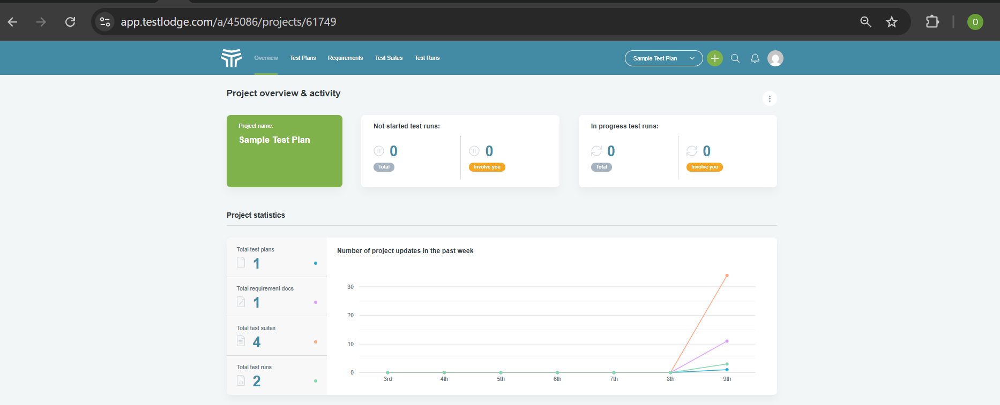
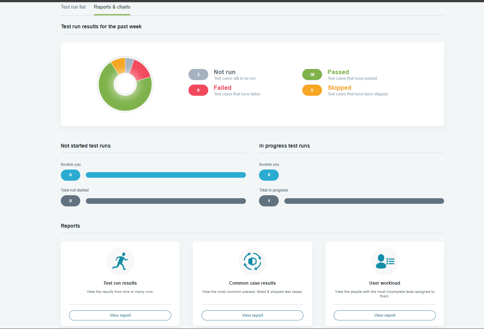

# QuickCart Online Store – Test Case Management with TestLodge

This repository demonstrates practical **test case management skills** using [TestLodge](https://www.testlodge.com/), a professional test management platform.

I designed, organized, and executed a complete set of test cases for a fictional e-commerce application (QuickCart Online Store).

## What Was Done

- Created a structured testing project with clear Test Suites and Sections  
- Wrote detailed, reusable test cases covering positive and negative scenarios  
- Linked requirements for basic traceability  
- Planned and executed Test Runs  
- Tracked results with Pass / Fail / Skip statuses and comments  
- Reviewed execution reports and statistics  

## Execution Results

| Metric              | Count |
|---------------------|-------|
| Total Tests         | 45    |
| Passed              | 32    |
| Failed              | 6     |
| Skipped             | 4     |

## Screenshots

| # | Description                        | Screenshot |
|---|------------------------------------|------------|
| 1 | Test Suites organized by feature   |  |
| 2 | Detailed test case structure       |  |
| 3 | Live test run execution            |  |
| 4 | Final Test Run summary             |  |
| 5 | Reports & statistics dashboard     |  |

## Skills Demonstrated

- Test case design and organization  
- Test suite structuring with sections  
- Test run planning and execution  
- Result tracking and basic reporting  
- Professional use of a modern test management tool  

## How to Explore

1. Review the screenshots above for a visual walkthrough.  
2. The test cases focused on core user flows: Authentication, Product Browsing, Cart, and Checkout.

---

**Note:** This is a practice project completed to build and showcase hands-on experience with test case management using TestLodge.